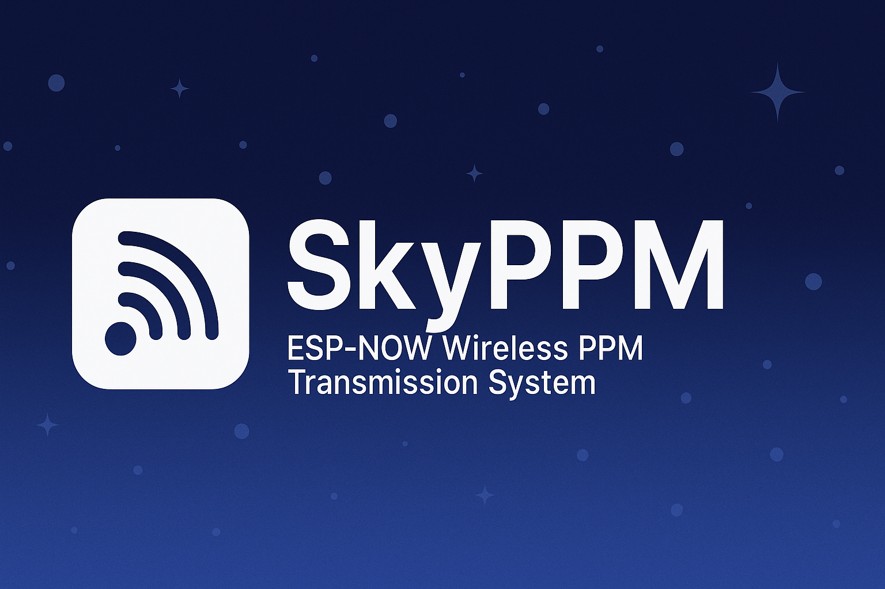

# 🌌 SkyPPM — ESP-NOW 无线 PPM 传输系统


> **SkyPPM** 是一个基于 **ESP-NOW** 协议的低延迟无线 PPM 传输方案。  
> 诞生的初衷是为了解决 **Walksnail Avatar Goggles X** 头追功能必须用有线 PPM 连接遥控器的麻烦问题，  
> 通过极其简单且廉价的硬件实现 **无线头追**，同时它也可应用于其他 RC 场景。

---

## 📖 项目背景

传统的 PPM 头追需要用一根长线从 **FPV 眼镜** 连接到 **遥控器**，不仅不美观，而且使用不便。  
**SkyPPM** 利用 **ESP-NOW** 直连通信，替代有线传输，让头追功能无线化，延迟低至毫秒级，使用体验更加自由。

除此之外，它也可作为通用的无线 PPM 链路，适用于：

- 无线教练口（Buddy Box）
- 无线飞控输入（飞机 / 四轴 / 船 / 车）
- 模型多机协同控制

---

## 📡 系统原理图


---

## 🛠 硬件特点

- **支持平台**：ESP32、ESP8266、ESP8285  
- **推荐方案**：ESP8285-01 模块  
  - 价格低至 **4.5 元人民币**（淘宝价）
  - 搭配一个 BEC 输出稳定的 **3.3V** 电压即可工作
  - 可直接从遥控器 JR 插槽取电  
- **连接简单**：仅需 PPM 信号线 + 电源线

---

## 🔌 接线说明

### 发送端（TX）
- **PPM 输入** → 来自 FPV 眼镜 / 教练口
- **电源输入** → 3.3V（可从遥控器 JR 插槽取电）
- **GND** → 公共地

### 接收端（RX）
- **PPM 输出** → 遥控器 / 飞控 / 其他设备
- **电源输入** → 3.3V（可用 BEC）
- **GND** → 公共地


---

## 🚀 特性

- **极低延迟**：ESP-NOW 点对点通信，延迟 < **5ms**
- **稳定可靠**：2.4GHz 直连，无需路由器
- **高兼容性**：支持任意接受 PPM 信号的设备
- **开源可改**：可根据自己需求修改通道数、帧率等参数

---

## 💻 编译 & 烧录

1. 安装 [Arduino IDE](https://www.arduino.cc/en/software)  
2. 安装 ESP8266 / ESP32 Arduino Core  
3. 克隆本仓库：
   ```bash
   git clone https://github.com/yourname/SkyPPM.git
